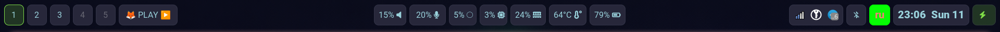

# Waybar Configuration — Практическое руководство

## Обзор



Это полностью проработанная конфигурация Waybar для Sway Wayland compositor. В этом руководстве описан не только конечный результат, но и подход к созданию, архитектура стилей, типичные ошибки и решения.

### Ключевые особенности

- **Семантическая цветовая система** — цвета разделены по смыслу, а не по модулям
- **Унифицированная архитектура** — все модули используют общие базовые стили
- **Учёт ограничений GTK CSS** — `@define-color` работает только для цветов
- **Мягкий визуальный стиль** — отсутствие кислотных оттенков, приятная палитра
- **Практичные скрипты** — JSON формат с правильными полями для tooltips

---

## Подход к созданию Waybar

### Архитектурные принципы

#### 1. Семантика вместо брендинга

**Проблема:** Многие используют цвета по бренду (Bluetooth синий, Spotify зелёный, VLC оранжевый). Это создаёт визуальный шум и делает невозможной быструю смену темы.

**Решение:** Цвет означает **состояние**, а не модуль:
- `state-success` — успешное состояние (зарядка, подключение)
- `state-warning` — предупреждение (balanced режим, уведомление)
- `state-error` — ошибка (критическая батарея, отключение)
- `accent-main` — активный элемент (фокус, текущий workspace)
- `accent-soft` — hover состояние

#### 2. Унификация модулей

Все модули наследуют базовый стиль `.module`:
```css
.module,
#clock,
#battery,
/* ... */
#workspaces button {
    background: @base-surface;
    border-radius: 9px;
    margin: 4px 3px;
    padding: 2px 8px;
    color: @text-primary;
    border: 1px solid @ui-border;
    transition: background-color 0.2s ease, border-color 0.2s ease;
}
```

**Почему это важно:**
- Любой новый модуль автоматически выглядит правильно
- Меньше кода для поддержки
- Единое ощущение интерфейса

#### 3. Учёт ограничений GTK CSS

**Важно:** В Waybar (GTK3) директива `@define-color` работает **только для цветов**.

**Ошибка:** Пытаться определить размеры и отступы через `@define-color`:
```css
/* НЕ БУДЕТ РАБОТАТЬ */
@define-color padding-default 8px;
.module { padding: @padding-default; }  /* ОШИБКА */
```

**Правильно:** Использовать переменные только для цветов, размеры задавать явно:
```css
/* РАБОТАЕТ */
@define-color ui-border rgba(68, 71, 90, 0.4);
.module {
    padding: 2px 8px;  /* Явные значения */
    border: 1px solid @ui-border;
}
```

---

## Семантическая цветовая система

### Структура

```css
/* Base — фоновые цвета */
@define-color base-bg rgba(18, 18, 26, 1);
@define-color base-surface rgba(39, 39, 58, 1);
@define-color base-overlay rgba(15, 15, 23, 0.4);

/* Text — цвета текста */
@define-color text-primary rgba(248, 248, 242, 1);
@define-color text-secondary rgba(176, 176, 184, 1);
@define-color text-disabled rgba(102, 102, 114, 1);

/* Accent — акцентные цвета */
@define-color accent-main rgba(126, 219, 71, 1);
@define-color accent-soft rgba(198, 255, 146, 1);
@define-color accent-peak rgba(0, 255, 0, 1);

/* State — цвета состояний */
@define-color state-success rgba(200, 255, 200, 1);
@define-color state-warning rgba(255, 216, 168, 1);
@define-color state-error rgba(255, 182, 182, 1);

/* Utility — вспомогательные цвета */
@define-color ui-border rgba(68, 71, 90, 0.4);
@define-color ui-hover rgba(68, 71, 90, 0.7);
```

### Использование

| Цвет | Применение |
|------|------------|
| `@base-surface` | Фон всех модулей |
| `@text-primary` | Основной текст |
| `@text-secondary` | Вторичный текст (пустые workspaces) |
| `@text-disabled` | Неактивные элементы |
| `@accent-main` | Фокус, активное состояние |
| `@accent-soft` | Hover, мягкое выделение |
| `@accent-peak` | Критические индикаторы (пульсация) |
| `@state-success` | Успешное состояние |
| `@state-warning` | Предупреждение |
| `@state-error` | Ошибка, критическое состояние |
| `@ui-border` | Границы модулей |
| `@ui-hover` | Hover фон |

### Практический пример

```css
/* Базовый модуль */
#network {
    color: @text-primary;  /* Стандартный цвет текста */
}

#network.disconnected {
    color: @state-error-text;  /* Ошибка связи */
}

/* Workspace */
#workspaces button.focused {
    border: 1px solid @ui-border-focus;
    background: rgba(126, 219, 71, 0.2);  /* Мягкий акцент */
    box-shadow: 0 0 8px rgba(126, 219, 71, 0.35);
}

/* Критический индикатор */
#language.ru {
    background: @accent-main;
    border: 2px solid @accent-peak;
    animation: accent-pulse 1.6s ease-in-out infinite;
}
```

---

## Установленные модули

### Левая панель
- **Workspaces** — переключение между рабочими столами
- **Recording Indicator** — индикатор записи wf-recorder
- **Sway Mode** — текущий режим Sway (например, resize)
- **Media Player** — универсальный медиа-плеер через playerctl

### Центральная панель
- **Clock** — часы и дата (клик открывает gsimplecal)
- **Language** — индикатор раскладки (RU/US)

### Правая панель
- **System Tray** — системный трей
- **Privacy** — индикаторы доступа (камера, микрофон, screenshare)
- **Network** — статус сети (Wi-Fi/Ethernet)
- **Audio** — громкость (скролл для регулировки)
- **Microphone** — микрофон (скролл для регулировки)
- **Backlight** — яркость экрана (скролл)
- **Bluetooth** — статус Bluetooth (клик → blueberry)
- **CPU** — использование процессора
- **Memory** — использование RAM
- **Temperature** — температура CPU
- **Keyboard State** — CapsLock/NumLock
- **Battery** — зарядка батареи
- **Power Profile** — профиль питания (performance/balanced/power-saver)

---

## Типичные ошибки и решения

### Ошибка 1: Tooltip показывает только префикс

**Проблема:**
```jsonc
"tooltip-format": "Микрофон: {alt}"
```
Показывает только "Микрофон:" без дополнительной информации.

**Причина:** Скрипт не возвращает поле `alt` в JSON.

**Решение:** Добавьте поле `alt` в вывод скрипта:
```bash
# microphone.sh
if [ "$IS_MUTED" = "yes" ]; then
  echo '{"text": "", "alt": "Выключен"}'
else
  echo "{\"text\": \"$VOLUME% \", \"alt\": \"Громкость: $VOLUME%\"}"
fi
```

### Ошибка 2: Брендовые цвета создают визуальный шум

**Проблема:**
```css
/* НЕПРАВИЛЬНО */
@define-color color-bluetooth-on rgba(33, 150, 243, 1);
@define-color color-media-spotify rgba(102, 204, 153, 0.3);
```
Модули выглядят разношёрстно, сложно менять тему.

**Решение:** Используйте семантические цвета:
```css
/* ПРАВИЛЬНО */
#bluetooth.on {
    color: @text-primary;  /* Стандартный цвет */
}

#custom-media {
    color: @text-primary;  /* Одинаковый стиль для всех плееров */
}
```

### Ошибка 3: @define-color для размеров

**Проблема:**
```css
/* НЕ БУДЕТ РАБОТАТЬ */
@define-color spacing 4px;
.module { margin: @spacing; }
```

**Решение:** Задавайте размеры явно:
```css
.module {
    margin: 4px 3px;  /* Прямое значение */
}
```

### Ошибка 4: Слишком кислотные акценты

**Проблема:** `#00FF00` (чистый зелёный) режет глаза.

**Решение:** Используйте мягкие оттенки:
```css
/* Вместо кислотного */
@define-color accent-peak rgba(0, 255, 0, 1);  /* Для пульсации */

/* Для основного акцента */
@define-color accent-main rgba(126, 219, 71, 1);  /* Мягкий лайм */

/* Для hover */
@define-color accent-soft rgba(198, 255, 146, 1);  /* Очень мягкий */
```

### Ошибка 5: Дублирование стилей

**Проблема:**
```css
#clock { margin: 4px 3px; padding: 2px 8px; }
#battery { margin: 4px 3px; padding: 2px 8px; }
#cpu { margin: 4px 3px; padding: 2px 8px; }
```

**Решение:** Общие стили вынести в `.module`:
```css
.module,
#clock,
#battery,
#cpu {
    margin: 4px 3px;
    padding: 2px 8px;
}
```

---

## Скрипты

### Общий формат

Все скрипты должны возвращать JSON с полями:
- `text` — текст для отображения в панели
- `alt` — текст для tooltip (важно!)
- `tooltip` — полный tooltip (опционально)

### microphone.sh

```bash
#!/bin/bash
DEFAULT_SOURCE=$(pactl get-default-source)
IS_MUTED=$(pactl get-source-mute "$DEFAULT_SOURCE" | grep -oP 'Mute: \K\S+')

if [ "$IS_MUTED" = "yes" ]; then
  echo '{"text": "", "alt": "Выключен"}'
else
  VOLUME=$(pactl get-source-volume "$DEFAULT_SOURCE" | grep -oP 'front-left:.*?/\K[0-9]+(?=%)' | head -1)
  echo "{\"text\": \"$VOLUME% \", \"alt\": \"Громкость: $VOLUME%\"}"
fi
```

### recording-indicator.sh

```bash
#!/bin/bash
if pgrep -f wf-recorder > /dev/null; then
    VIDEO_FILE=$(ls -t ~/Images/videos/record-*.mp4 2>/dev/null | head -1)
    if [ -f "$VIDEO_FILE" ]; then
        DURATION=$(ffprobe -i "$VIDEO_FILE" -show_entries format=duration -v quiet -of csv="p=0")
        MINUTES=$(( ${DURATION%.*} / 60 ))
        SECONDS=$(( ${DURATION%.*} % 60 ))
        echo "{\"text\": \"REC ●\", \"alt\": \"Длительность: ${MINUTES}m ${SECONDS}s\"}"
    fi
else
    echo '{"text": "", "alt": ""}'
fi
```

---

## Анимации

### Pulse для критических индикаторов

Мягкая пульсация вместо резкого мигания:

```css
@keyframes accent-pulse {
    0%   { background-color: @accent-main; }
    50%  { background-color: @accent-peak; }
    100% { background-color: @accent-main; }
}

#language.ru,
#custom-recording {
    background: @accent-main;
    border: 2px solid @accent-peak;
    color: @text-primary;
    animation: accent-pulse 1.6s ease-in-out infinite;
}
```

### Увеличенный интервал (1.6s вместо 1.5s) для мягкости

---

## Интеграция с Sway

### Запись экрана

В `~/.config/sway/config`:

```
# Запись экрана с wf-recorder
bindsym --to-code $mod+Shift+r exec wf-recorder -g "$(slurp)" -f ~/Images/videos/record-$(date +'%Y-%m-%d-%H%M%S').mp4
```

При запуске записи появится моргающий индикатор "REC ●".

---

## Кастомизация

### Добавление нового модуля

1. Добавьте в `config.jsonc`:
```jsonc
"modules-right": [
    "tray",
    "network",
    "my-custom-module"
]
```

2. Настройте модуль:
```jsonc
"custom/my-module": {
    "exec": "~/.config/waybar/scripts/my-script.sh",
    "return-type": "json",
    "interval": 2
}
```

3. Добавьте стиль в `style.css`:
```css
/* Базовый стиль уже унаследован через .module */
#my-custom-module:hover {
    background-color: @ui-hover;
    border-color: @accent-soft;
}
```

### Изменение цветовой темы

Отредактируйте только семантические цвета в начале `style.css`:
```css
/* Измените эти значения — всё обновится автоматически */
@define-color base-surface rgba(45, 45, 60, 1);
@define-color text-primary rgba(255, 255, 255, 1);
@define-color accent-main rgba(100, 200, 255, 1);
```

### Изменение размеров

Отредактируйте базовый стиль `.module`:
```css
.module,
#clock,
#battery,
/* ... */
#workspaces button {
    margin: 4px 3px;       /* Отступы */
    padding: 2px 8px;      /* Внутренние отступы */
    border-radius: 9px;     /* Закругление */
    min-height: 20px;      /* Минимальная высота */
}
```

---

## Запуск и перезагрузка

### Запуск
```bash
waybar
```

### Перезагрузка конфигурации
```bash
killall waybar && waybar &
```

### Отладка
```bash
waybar -c /path/to/config.jsonc --log-level debug
```

---

## Зависимости

### Основные
- `waybar` — панель
- `sway` — оконный менеджер (Wayland compositor)

### Функциональные
- `playerctl` — для медиа-плеера
- `wf-recorder` — для записи экрана
- `slurp` — для выбора области записи
- `ffmpeg` (ffprobe) — для длительности видео
- `blueberry` — для управления Bluetooth
- `pavucontrol` — для управления звуком
- `brightnessctl` — для управления яркостью
- `powerprofilesctl` — для профилей питания
- `gsimplecal` — для календаря
- `pactl` — часть PulseAudio (управление звуком)

---

## Дополнительные ресурсы

- [Waybar GitHub](https://github.com/Alexays/Waybar)
- [Waybar Documentation](https://man.archlinux.org/man/waybar.5.en)
- [GTK CSS Properties](https://docs.gtk.org/gtk3/css-properties.html)
- [Sway Documentation](https://man.archlinux.org/man/sway.5.en)
- [Playerctl](https://github.com/altdesktop/playerctl)

---

## Лицензия

Эта конфигурация может использоваться свободно.
