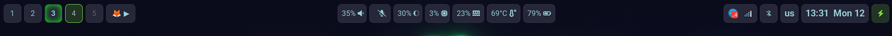

# Waybar Configuration — Practical Guide

🇷🇺 **Русская версия:** [README.md](README.md)



This is a fully developed Waybar configuration for Sway Wayland compositor. This guide describes not only the final result, but also the approach to creation, style architecture, typical errors and solutions.

### Key Features

- **Semantic Color System** — colors separated by meaning, not by module
- **Unified Architecture** — all modules use common base styles
- **Accounting for GTK CSS Limitations** — `@define-color` works only for colors
- **Soft Visual Style** — no harsh shades, pleasant palette
- **Practical Scripts** — JSON format with correct fields for tooltips

---

## Approach to Creating Waybar

### Architectural Principles

#### 1. Semantics over Branding

**Problem:** Many use colors by brand (Bluetooth blue, Spotify green, VLC orange). This creates visual noise and makes quick theme changes impossible.

**Solution:** Color means **state**, not module:
- `state-success` — successful state (charging, connected)
- `state-warning` — warning (balanced mode, notification)
- `state-error` — error (critical battery, disconnection)
- `accent-main` — active element (focus, current workspace)
- `accent-soft` — hover state

#### 2. Module Unification

All modules inherit base style `.module`:
```css
.module,
#clock,
#battery,
/* ... */
#workspaces button {
    background: @base-surface;
    border-radius: 9px;
    margin: 4px 3px;
    padding: 2px 8px;
    color: @text-primary;
    border: 1px solid @ui-border;
    transition: background-color 0.2s ease, border-color 0.2s ease;
}
```

**Why this is important:**
- Any new module automatically looks correct
- Less code to maintain
- Consistent interface feel

#### 3. Accounting for GTK CSS Limitations

**Important:** In Waybar (GTK3), the `@define-color` directive works **only for colors**.

**Error:** Trying to define sizes and margins via `@define-color`:
```css
/* WILL NOT WORK */
@define-color padding-default 8px;
.module { padding: @padding-default; }  /* ERROR */
```

**Correct:** Use variables only for colors, specify sizes explicitly:
```css
/* WORKS */
@define-color ui-border rgba(68, 71, 90, 0.4);
.module {
    padding: 2px 8px;  /* Explicit values */
    border: 1px solid @ui-border;
}
```

---

## Semantic Color System

### Structure

```css
/* Base — background colors */
@define-color base-bg rgba(18, 18, 26, 1);
@define-color base-surface rgba(39, 39, 58, 1);
@define-color base-overlay rgba(15, 15, 23, 0.4);

/* Text — text colors */
@define-color text-primary rgba(248, 248, 242, 1);
@define-color text-secondary rgba(176, 176, 184, 1);
@define-color text-disabled rgba(102, 102, 114, 1);

/* Accent — accent colors */
@define-color accent-main rgba(126, 219, 71, 1);
@define-color accent-soft rgba(198, 255, 146, 1);
@define-color accent-peak rgba(0, 255, 0, 1);

/* State — state colors */
@define-color state-success rgba(200, 255, 200, 1);
@define-color state-warning rgba(255, 216, 168, 1);
@define-color state-error rgba(255, 182, 182, 1);

/* Utility — helper colors */
@define-color ui-border rgba(68, 71, 90, 0.4);
@define-color ui-hover rgba(68, 71, 90, 0.7);
```

### Usage

| Color | Application |
|-------|-------------|
| `@base-surface` | Background of all modules |
| `@text-primary` | Main text |
| `@text-secondary` | Secondary text (empty workspaces) |
| `@text-disabled` | Inactive elements |
| `@accent-main` | Focus, active state |
| `@accent-soft` | Hover, soft highlight |
| `@accent-peak` | Critical indicators (pulsation) |
| `@state-success` | Successful state |
| `@state-warning` | Warning |
| `@state-error` | Error, critical state |
| `@ui-border` | Module borders |
| `@ui-hover` | Hover background |

### Practical Example

```css
/* Base module */
#network {
    color: @text-primary;  /* Standard text color */
}

#network.disconnected {
    color: @text-error;  /* Connection error */
}

/* Workspace */
#workspaces button.focused {
    border: 1px solid @ui-border-focus;
    background: rgba(126, 219, 71, 0.2);  /* Soft accent */
    box-shadow: 0 0 8px rgba(126, 219, 71, 0.35);
}

/* Critical indicator */
#language.ru {
    background: @accent-main;
    border: 2px solid @accent-peak;
    animation: accent-pulse 1.6s ease-in-out infinite;
}
```

---

## Installed Modules

### Left Panel
- **Workspaces** — workspace switching
- **Recording Indicator** — wf-recorder recording indicator
- **Sway Mode** — current Sway mode (e.g., resize)
- **Media Player** — universal media player via playerctl

### Center Panel
- **Clock** — clock and date (click opens gsimplecal)
- **Language** — layout indicator (RU/US)

### Right Panel
- **System Tray** — system tray
- **Privacy** — access indicators (camera, microphone, screenshare)
- **Network** — network status (Wi-Fi/Ethernet)
- **Audio** — volume (scroll to adjust)
- **Microphone** — microphone (scroll to adjust)
- **Backlight** — screen brightness (scroll to adjust)
- **Bluetooth** — Bluetooth status (click → blueberry)
- **CPU** — CPU usage
- **Memory** — RAM usage
- **Temperature** — CPU temperature
- **Keyboard State** — CapsLock/NumLock
- **Battery** — battery charge
- **Power Profile** — power profile (performance/balanced/power-saver)

---

## Common Errors and Solutions

### Error 1: Tooltip shows only prefix

**Problem:**
```jsonc
"tooltip-format": "Microphone: {alt}"
```
Shows only "Microphone:" without additional information.

**Cause:** Script doesn't return the `alt` field in JSON.

**Solution:** Add `alt` field to script output:
```bash
# microphone.sh
if [ "$IS_MUTED" = "yes" ]; then
  echo '{"text": "", "alt": "Muted"}'
else
  echo "{\"text\": \"$VOLUME% \", \"alt\": \"Volume: $VOLUME%\"}"
fi
```

### Error 2: Brand colors create visual noise

**Problem:**
```css
/* INCORRECT */
@define-color color-bluetooth-on rgba(33, 150, 243, 1);
@define-color color-media-spotify rgba(102, 204, 153, 0.3);
```
Modules look inconsistent, difficult to change theme.

**Solution:** Use semantic colors:
```css
/* CORRECT */
#bluetooth.on {
    color: @text-primary;  /* Standard color */
}

#custom-media {
    color: @text-primary;  /* Same style for all players */
}
```

### Error 3: @define-color for sizes

**Problem:**
```css
/* WILL NOT WORK */
@define-color spacing 4px;
.module { margin: @spacing; }
```

**Solution:** Specify sizes explicitly:
```css
.module {
    margin: 4px 3px;  /* Direct value */
}
```

### Error 4: Too harsh accent colors

**Problem:** `#00FF00` (pure green) is too bright and harsh.

**Solution:** Use soft shades:
```css
/* Instead of harsh */
@define-color accent-peak rgba(0, 255, 0, 1);  /* For pulsation */

/* For main accent */
@define-color accent-main rgba(126, 219, 71, 1);  /* Soft lime */

/* For hover */
@define-color accent-soft rgba(198, 255, 146, 1);  /* Very soft */
```

### Error 5: Style duplication

**Problem:**
```css
#clock { margin: 4px 3px; padding: 2px 8px; }
#battery { margin: 4px 3px; padding: 2px 8px; }
#cpu { margin: 4px 3px; padding: 2px 8px; }
```

**Solution:** Move common styles to `.module`:
```css
.module,
#clock,
#battery,
#cpu {
    margin: 4px 3px;
    padding: 2px 8px;
}
```

---

## Scripts

### General Format

All scripts should return JSON with fields:
- `text` — text for display in the panel
- `alt` — text for tooltip (important!)
- `tooltip` — full tooltip (optional)

### Script Optimization

**Problem:** The `media.sh` script can significantly load the CPU when running frequently (by default, Waybar calls scripts every 2 seconds). Despite optimization with caching and throttling, the problem persists during active playback.

**Current optimization in media.sh:**
- Caching in `~/.cache/waybar/waybar-media.json` — fast response
- Interval check — no more than once every 5 seconds
- State comparison — exit if nothing changed

**Recommendations for further optimization:**

1. **Use systemd user service with events**
   ```bash
   # ~/.config/systemd/user/waybar-media-monitor.service
   [Unit]
   Description=Waybar Media Monitor

   [Service]
   ExecStart=/usr/bin/playerctl --follow metadata --format '...'
   ExecStartPost=/bin/sh -c 'echo "%s" > ~/.cache/waybar/waybar-media.json'
   Restart=always
   ```
   The Waybar script will only read the cache, while the daemon handles events.

2. **Use playerctl --follow for event-driven approach**
   ```bash
   # Start background process once
   playerctl --follow metadata -f '...' | while read -r line; do
       echo "$line" > "$CACHE"
   done &
   # In the script itself, just cat "$CACHE"
   ```

3. **Increase execution interval in config.jsonc**
   ```jsonc
   "custom/media": {
       "exec": "~/.config/waybar/scripts/media.sh",
       "interval": 10,  /* Increase from 2 to 10 */
       "return-type": "json"
   }
   ```

4. **Alternative — Python with asyncio + mpris**
   ```python
   # Use mpris library to listen to D-Bus events
   # Completely event-driven, zero CPU load when idle
   ```

**Most effective solution:** option 1 or 2 — event-driven approach with a daemon that updates the cache only on real player changes, not on a timer.

### microphone.sh

```bash
#!/bin/bash
DEFAULT_SOURCE=$(pactl get-default-source)
IS_MUTED=$(pactl get-source-mute "$DEFAULT_SOURCE" | grep -oP 'Mute: \K\S+')

if [ "$IS_MUTED" = "yes" ]; then
  echo '{"text": "", "alt": "Muted"}'
else
  VOLUME=$(pactl get-source-volume "$DEFAULT_SOURCE" | grep -oP 'front-left:.*?/\K[0-9]+(?=%)' | head -1)
  echo "{\"text\": \"$VOLUME% \", \"alt\": \"Volume: $VOLUME%\"}"
fi
```

### recording-indicator.sh

```bash
#!/bin/bash
if pgrep -f wf-recorder > /dev/null; then
    VIDEO_FILE=$(ls -t ~/Images/videos/record-*.mp4 2>/dev/null | head -1)
    if [ -f "$VIDEO_FILE" ]; then
        DURATION=$(ffprobe -i "$VIDEO_FILE" -show_entries format=duration -v quiet -of csv="p=0")
        MINUTES=$(( ${DURATION%.*} / 60 ))
        SECONDS=$(( ${DURATION%.*} % 60 ))
        echo "{\"text\": \"REC ●\", \"alt\": \"Duration: ${MINUTES}m ${SECONDS}s\"}"
    fi
else
    echo '{"text": "", "alt": ""}'
fi
```

---

## Animations

### Pulse for Critical Indicators

Soft pulsation instead of harsh blinking:

```css
@keyframes accent-pulse {
    0%   { background-color: @accent-main; }
    50%  { background-color: @accent-peak; }
    100% { background-color: @accent-main; }
}

#language.ru,
#custom-recording {
    background: @accent-main;
    border: 2px solid @accent-peak;
    color: @text-primary;
    animation: accent-pulse 1.6s ease-in-out infinite;
}
```

### Increased interval (1.6s instead of 1.5s) for softness

---

## Sway Integration

### Screen Recording

In `~/.config/sway/config`:

```
# Screen recording with wf-recorder
bindsym --to-code $mod+Shift+r exec wf-recorder -g "$(slurp)" -f ~/Images/videos/record-$(date +'%Y-%m-%d-%H%M%S').mp4
```

When recording starts, a blinking "REC ●" indicator will appear.

---

## Customization

### Adding a New Module

1. Add to `config.jsonc`:
```jsonc
"modules-right": [
    "tray",
    "network",
    "my-custom-module"
]
```

2. Configure the module:
```jsonc
"custom/my-module": {
    "exec": "~/.config/waybar/scripts/my-script.sh",
    "return-type": "json",
    "interval": 2
}
```

3. Add style to `style.css`:
```css
/* Base style already inherited via .module */
#my-custom-module:hover {
    background-color: @ui-hover;
    border-color: @accent-soft;
}
```

### Changing Color Theme

Edit only semantic colors at the beginning of `style.css`:
```css
/* Change these values — everything will update automatically */
@define-color base-surface rgba(45, 45, 60, 1);
@define-color text-primary rgba(255, 255,255, 1);
@define-color accent-main rgba(100, 200, 255, 1);
```

### Changing Sizes

Edit base style `.module`:
```css
.module,
#clock,
#battery,
/* ... */
#workspaces button {
    margin: 4px 3px;       /* Spacing */
    padding: 2px 8px;      /* Inner padding */
    border-radius: 9px;     /* Rounding */
    min-height: 20px;      /* Minimum height */
}
```

---

## Launch and Reload

### Launch
```bash
waybar
```

### Reload Configuration
```bash
killall waybar && waybar &
```

### Debug
```bash
waybar -c /path/to/config.jsonc --log-level debug
```

---

## Dependencies

### Core
- `waybar` — panel
- `sway` — window manager (Wayland compositor)

### Functional
- `playerctl` — for media player
- `wf-recorder` — for screen recording
- `slurp` — for recording area selection
- `ffmpeg` (ffprobe) — for video duration
- `blueberry` — for Bluetooth management
- `pavucontrol` — for sound management
- `brightnessctl` — for brightness control
- `powerprofilesctl` — for power profiles
- `gsimplecal` — for calendar
- `pactl` — part of PulseAudio (sound control)

---

## Additional Resources

- [Waybar GitHub](https://github.com/Alexays/Waybar)
- [Waybar Documentation](https://man.archlinux.org/man/waybar.5.en)
- [GTK CSS Properties](https://docs.gtk.org/gtk3/css-properties.html)
- [Sway Documentation](https://man.archlinux.org/man/sway.5.en)
- [Playerctl](https://github.com/altdesktop/playerctl)

---

## License

This configuration may be used freely.
